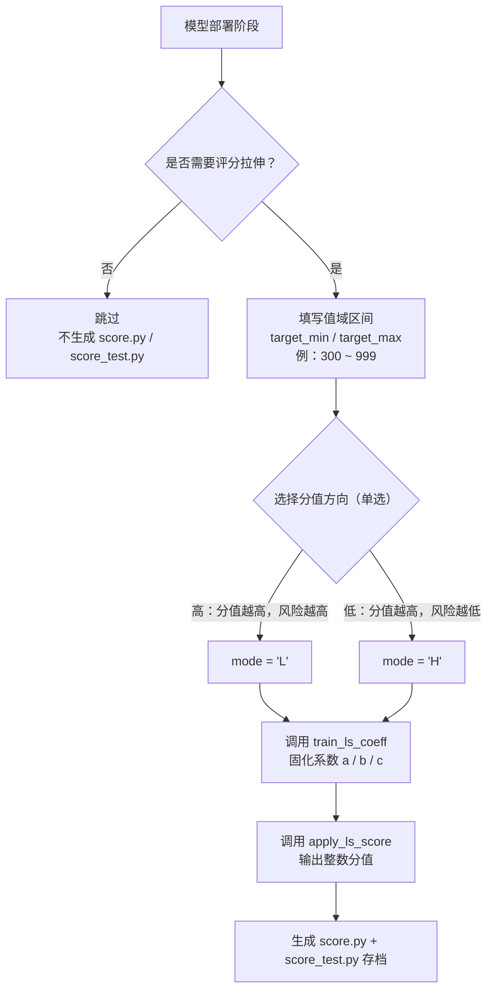

# 百擎训练模型产出文件规范

**文档编号：** LDM-TN-2026-002
**文档状态：** 草稿 · 待评审
**创建日期：** 2026-06-04

---

## 1. 文档目的

规范百擎平台训练完成后产出的离线模型文件结构，保证模型从百擎平台迁移到百基平台后打分结果一致。

---

## 2. 背景与现状

### 2.1 现状描述

百擎平台完成模型训练后，产出一个 `.pkl` 文件，现需将百擎的训练链路迁移到百基平台，但百擎平台生成的单 pkl 文件不能在百基平台直接打分。

### 2.2 变更原因

百擎平台产出的文件需要满足百基平台的打分要求，并保证打分一致性。

---

## 3. 目标与范围

### 3.1 业务目标

模型跨平台迁移后，百基平台打分结果与百擎平台保持一致。

### 3.2 技术目标

分析师调用函数直接生成 LDM 标准离线文件：**1 个 pkl 文件和 5 个自描述文件**（io_schema.json、source_meta.json、test_cases.json、score.py、score_test.py），对所要生成的文件进行规范。

### 3.3 业务范围

| 系统模块 | 变更类型 | 说明 |
|----------|----------|------|
| 1 个 pkl + 5 个自描述文件直接生成 | 规则新增 | 分析师调用生成函数，产出 LDM 离线文件 |
| 百擎业务场景中评分拉伸交互逻辑 | 规则新增 | 百擎平台在**模型部署**阶段设置交互逻辑：① 用户选择是否需要拉伸；② 用户填写值域区间（如 300-999，须满足最大值 > 最小值）；③ 用户选择**分值方向**（单选）：**高** = 分值越高风险越高 / **低** = 分值越高风险越低，平台据此映射为 `mode='L'` 或 `mode='H'`；④ 平台调取拉伸函数；⑤ 给出最终分值 |

---

## 4. 需求描述

### 4.1 功能描述

#### 4.1.1 模型文件目录

百擎平台生成的 pkl 文件与函数生成的 5 个自描述文件同级存放，构成一个完整的离线文件包。

```
raw/<business_scene>_tab<arch>_n<N>_f<F>_<rows>/
├── <同名>.pkl            # 百擎平台训练产出
├── io_schema.json        # 定义输入和输出
├── source_meta.json      # 环境
├── test_cases.json       # 测试
├── score.py              # 概率→整数分值映射
└── score_test.py         # 分值测试
```

**目录命名字段说明：**

| 字段 | 示例 | 取值规则 |
|------|------|----------|
| `business_scene` | `credit_risk` | 取系统配置的业务场景名称 |
| `arch` | `2.5` | 当前固定为 2.5 |
| `N` | `4` | 取百擎模型复杂度字段：简单=1，复杂=4 |
| `F` | `147` | 取百擎系统经过筛选后的特征量 |
| `rows` | `6000` | 取百擎系统对应的样本量 |

---

#### 4.1.2 io_schema.json

定义模型推理时的输入特征列表及输出类别标签。**inputs 的顺序即为特征输入顺序，百基平台必须严格按此顺序传参。**

**生成函数：** `generate_io_schema(X, y, feature_dtypes=None)`

| 参数 | 说明 |
|------|------|
| `X` | 训练集特征，DataFrame 或 ndarray |
| `y` | 训练集标签 |
| `feature_dtypes` | 可选，手动指定列类型，如 `{'city': 'categorical'}`；不传则自动推断 |

**函数逻辑（关键步骤）：**

1. **特征顺序**：按 X 的列顺序逐列生成 inputs 列表，列表顺序即为百基传参顺序，不得打乱
2. **类型判断**：int/float 列 → `numeric`；其余（object、bool 等）→ `categorical`；categorical 列自动提取训练集中的全量枚举值作为 categories，超过 100 个时打印警告
3. **正类确定**：取标签最大值作为 positive_class；`positive_class_meaning` 当前函数硬编码为 `"default / bad"`，如需修改须在函数内手动调整
4. **输出格式约束**：保存时必须使用 `indent=2, ensure_ascii=False`，不得修改

**输出示例（截取前 3 条）：**

```json
{
  "schema_version": 1,
  "inputs": [
    {
      "name": "rsm_scoreriskass_offline",
      "dtype": "numeric",
      "required": true,
      "missing_allowed": true
    },
    {
      "name": "almf_m3_id_nbank_else_orgnum_slope",
      "dtype": "numeric",
      "required": true,
      "missing_allowed": true
    }
  ],
  "outputs": {
    "classes": [0.0, 1.0],
    "positive_class": 1,
    "positive_class_meaning": "default / bad",
    "n_classes": 2
  }
}
```

**字段说明：**

| 字段 | 示例 | 取值规则 |
|------|------|----------|
| `inputs.name` | `age` | 取入模变量名称 |
| `inputs.dtype` | `numeric` | 数值型取 numeric，类别型取 categorical。**目前只支持 numeric** |
| `inputs.required` | `true` | 当前固定为 true |
| `inputs.missing_allowed` | `true` | 当前固定为 true |
| `inputs.categories` | `["bj","sh","gz","other"]` | 仅 categorical 类型存在，取该特征的全量枚举值 |
| `outputs.classes` | `[0, 1]` | 取模型输出的全部类别标签 |
| `outputs.positive_class` | `1` | 取正样本对应的类别标签 |
| `outputs.positive_class_meaning` | `default/bad` | 取正样本对应的业务含义。**函数当前硬编码为 "default / bad"，如需修改在函数内手动调整** |
| `outputs.n_classes` | `2` | 取类别总数 |

---

#### 4.1.3 source_meta.json

记录模型生成时的完整环境快照，用于百基平台环境兼容性验证和文件完整性校验。

**生成函数：** `generate_source_meta(pkl_path, X, business_scene="credit_risk", arch=None)`

| 参数 | 说明 |
|------|------|
| `pkl_path` | pkl 文件路径，函数据此计算 SHA-256 |
| `X` | 训练集特征，用于读取 n_features 和 n_train_rows |
| `business_scene` | 业务场景名，默认 `credit_risk` |
| `arch` | 模型架构版本，当前函数中已注释（默认写死 V2.5），使用其他架构时取消注释 |

**函数逻辑（关键步骤）：**

1. **SHA-256**：对 pkl 文件逐块读取，计算哈希值，生成 64 位十六进制字符串。此值是三方一致性校验的锚点：`source_meta.pkl_sha256` == `sha256(pkl 本体)` == `test_cases.generated_with.pkl_sha256`，三者必须相同
2. **版本号**：从当前运行环境自动读取 tabpfn / sklearn / numpy / python / torch 版本；单环境工作流下训练环境与捕获环境相同，故自动读取即等于训练时版本
3. **shape 字段**：`n_features` 和 `n_train_rows` 直接从入参 X 的维度（`X.shape[1]` 和 `X.shape[0]`）读取；`n_estimators` 从加载的模型对象属性读取
4. **可扩展性**：source 对象不限于内置 5 个版本字段，如有其他依赖库可自行追加（如 `pandas_version`、`cuda_version`），命名统一用 `<库名>_version` 格式

**输出示例：**

```json
{
  "schema_version": 1,
  "pkl_sha256": "84fc7cda9bd365fbaf8b96a850ffcf5a122eb56fe76105c1c683f54b6b4d9f4c",
  "captured_at": "2026-06-03T12:47:54Z",
  "env_capture": "single-env workflow: train env == capture env",
  "source": {
    "kind": "LDM-tn",
    "tabpfn_version": "6.3.2",
    "sklearn_version": "1.6.1",
    "numpy_version": "1.26.4",
    "python_version": "3.9.2",
    "torch_version": "2.5.1+cu124"
  },
  "shape": {
    "n_estimators": 1,
    "n_features": 100,
    "n_train_rows": 10000
  },
  "naming": {
    "business_scene": "credit_risk",
    "n": 1,
    "f": 100,
    "rows": 10000
  }
}
```

**字段说明：**

| 字段 | 示例 | 取值规则 |
|------|------|----------|
| `source.kind` | `LDM-tn` | **本次固定为 LDM-tn**，是 LDM 文件格式的固定标识符，百基平台可用此字段识别文件类型 |
| `source.tabpfn_version` | `6.3.2` | 按模型环境自动生成，若有不兼容按示例填写 |
| `source.sklearn_version` | `1.6.1` | 按模型环境自动生成，若有不兼容按示例填写 |
| `source.numpy_version` | `1.26.4` | 按模型环境自动生成，若有不兼容按示例填写 |
| `source.python_version` | `3.9.2` | 按模型环境自动生成，若有不兼容按示例填写 |
| `source.torch_version` | `2.5.1+cu124` | 按模型环境自动生成，若有不兼容按示例填写 |
| `naming.business_scene` | `credit_risk` | 本次默认固定为 credit_risk；支持其他场景时在生成函数中动态传参 |

> matplotlib 等库版本差异不影响主流程，无需对齐，**仅以上 5 个版本需精确匹配**。

---

#### 4.1.4 test_cases.json

记录在百擎平台生成的金标准验证用例，供百基平台迁移后验证打分一致性。

**生成函数：** `generate_test_cases(pkl_path, X, y, feature_names=None, n_cases=1)`

| 参数 | 说明 |
|------|------|
| `pkl_path` | pkl 文件路径，用于加载模型和计算 SHA-256 |
| `X` | 训练集特征，取其中指定行作为测试输入 |
| `y` | 训练集标签（当前函数未直接使用，预留参数） |
| `feature_names` | 可选，手动指定特征名；不传则从 X 列名或 feat_0/feat_1... 自动生成 |
| `n_cases` | 生成用例数，当前函数固定取第 0 行，此参数实际未起效 |

**函数逻辑（关键步骤）：**

1. **推理过程**：加载 pkl 模型后调用 `classifier.eval()`（关闭 dropout，确保结果确定性），取第 0 行样本转为 float32 数组，调用 `predict_proba` 得到各类概率，保留 6 位小数
2. **设备检测**：自动判断当前环境是否有 CUDA，有则写 `cuda`，否则写 `cpu`；百基平台须在相同设备上复现，否则 bf16 精度下可能产生 ±0.006 的误差
3. **input 内容**：取第 0 行的完整特征名与对应值，NaN 值原样保留
4. **不含 expected_score**：当前函数只输出 `expected_proba`，需要概率→分值验证时须另行用 `apply_ls_score` 补充 `expected_score` 字段
5. **tolerance 含义**：`proba_abs_fp32=0` 表示相同设备下 fp32 精度要求精确一致；`proba_abs_bf16=0.006` 表示 bf16 精度允许 ±0.006 偏差

**输出示例（input 截取前 5 条）：**

```json
{
  "schema_version": 1,
  "generated_with": {
    "pkl_sha256": "84fc7cda9bd365fbaf8b96a850ffcf5a122eb56fe76105c1c683f54b6b4d9f4c",
    "tabpfn_version": "6.3.2",
    "dtype": "float32",
    "device": "cuda"
  },
  "tolerance": {
    "proba_abs_fp32": 0.0,
    "proba_abs_bf16": 0.006,
    "score_exact_fp32": true
  },
  "cases": [
    {
      "input": {
        "rsm_scoreriskass_offline": 0.123943,
        "almf_m3_id_nbank_else_orgnum_slope": 0.377541,
        "mmb_var12": NaN,
        "..."  : "..."
      },
      "expected_proba": [0.552109, 0.447891]
    }
  ]
}
```

**字段说明：**

| 字段 | 示例 | 取值规则 |
|------|------|----------|
| `generated_with.pkl_sha256` | 64-hex | pkl 文件的 SHA-256 哈希值，自动计算 |
| `generated_with.tabpfn_version` | `6.3.2` | 按示例填写 |
| `generated_with.dtype` | `float32` | 按示例填写 |
| `generated_with.device` | `cuda` | 按实际环境自动检测。**百基平台推理设备须与此字段一致** |
| `tolerance` | — | 本次固定，按示例填写 |
| `cases.input` | 列名对应的一行值 | 取第 0 行的特征名和对应值 |
| `cases.expected_score` | 对应最终输出分值 | 有分值需求时按最终输出填写，无则省略 |

---

#### 4.1.5 score.py

将正类概率映射为整数分值。**没有评分需求时不需要此文件，目录中也不包含此文件。**

---

**一、百擎平台交互流程**



---

**二、入参说明**

3 个函数共用以下参数：

| 参数 | 适用函数 | 说明 |
|------|----------|------|
| `prob_series` | `function_ls` / `train_ls_coeff` | 训练集正类概率列（Series 或 ndarray），用于计算均值以拟合系数 |
| `target_min` | `function_ls` / `train_ls_coeff` | 分值区间下限，如 300 |
| `target_max` | `function_ls` / `train_ls_coeff` | 分值区间上限，如 999；须满足 `target_max > target_min` |
| `mode` | `function_ls` / `train_ls_coeff` | `'L'`：分值越高风险越高；`'H'`：分值越高风险越低 |
| `prob` | `apply_ls_score` | 单个概率值或概率数组，范围 [0, 1] |
| `coeff_dict` | `apply_ls_score` | `train_ls_coeff` 返回的系数字典 `{a, b, c, mode, target_min, target_max}` |

---

**三、评分拉伸逻辑**

使用二次函数将概率区间 [0, 1] 单调映射到整数分值区间 [target_min, target_max]，并保证训练集均值概率对应区间中点分值。

**▍映射公式**

```
score(p) = a · p² + b · p + c
```

**▍系数求解（5 步）**

| 步骤 | 公式 | 说明 |
|------|------|------|
| ① | `c = target_min` | 当 p=0 时，score = target_min |
| ② | `delta = target_max - target_min` | 分值区间跨度 |
| ③ | `mid = (target_min + target_max) / 2` | 分值区间中点 |
| ④ | `mean_p = 训练集正类概率均值` | 由训练集统计得出 |
| ⑤ | `a = (mid - c - delta × mean_p) / (mean_p² - mean_p)` | 令均值概率对应中点分值，联立求解 a |
|   | `b = delta - a` | 由边界条件 score(1) = target_max 推导 |

**▍边界验证**

| 输入概率 | 代入公式 | 结果 |
|----------|----------|------|
| p = 0 | `a×0 + b×0 + c` | = `target_min` |
| p = 1 | `a + b + c = delta + c` | = `target_max` |
| p = mean_p | 由 ⑤ 保证 | = `mid`（区间中点） |

**▍退化为线性的两种情况**

| 触发条件 | 原因 | 处理方式 |
|----------|------|----------|
| `mean_p == 0` 或 `mean_p == 1` | 训练集概率全部集中在端点，二次项无意义 | 令 a=0，b=delta |
| `b < 0` 或 `(2a+b) < 0` | 二次函数在 [0,1] 内不单调，映射会出现反转 | 令 a=0，b=delta |

退化后公式变为：`score(p) = delta · p + target_min`，即线性拉伸。

**▍mode 方向处理**

mode 控制概率与分值的方向关系，在代入公式**之前**处理：

| mode | 预处理 | 效果 |
|------|--------|------|
| `'L'` | p 不变，直接代入 | 概率越高 → 分值越高（高分 = 高风险，拒绝高分用户） |
| `'H'` | `p = 1 - p`，再代入 | 概率越高 → 分值越低（高分 = 低风险，通过高分用户） |

**▍精度与输出**

- 系数 a、b、c 均四舍五入保留 **4 位小数**
- 映射结果四舍五入取整，输出为 **int**

---

**四、生成函数代码**

3 个函数职责分工：

| 函数 | 调用方 | 职责 |
|------|--------|------|
| `function_ls` | 百擎分析师 | 内部验证：输入整列概率，直接返回整列分值，用于分布可视化确认拉伸效果 |
| `train_ls_coeff` | 百擎分析师 | 固化系数：逻辑与 `function_ls` 相同，但只返回系数字典，**供百基部署时使用** |
| `apply_ls_score` | 百基研发 | 推理打分：加载固化系数，对单个或批量概率输出整数分值 |

```python
import pandas as pd
import numpy as np

def function_ls(prob_series, target_min, target_max, mode='L'):
    if isinstance(prob_series, pd.Series):
        probs = prob_series.values
        index = prob_series.index
        is_series = True
    else:
        probs = np.asarray(prob_series)
        is_series = False

    if mode == 'H':
        probs = 1 - probs

    c = target_min
    delta = target_max - target_min
    mean_prob = np.mean(probs)
    mid = (target_min + target_max) / 2.0

    if mean_prob == 0 or mean_prob == 1:
        a, b = 0.0, delta
    else:
        denominator = mean_prob**2 - mean_prob
        a = (mid - c - delta * mean_prob) / denominator if denominator != 0 else 0.0
        b = delta - a

    if b < 0 or (2*a + b) < 0:
        a, b = 0.0, delta

    a, b, c = round(a, 4), round(b, 4), round(c, 4)
    mapped = np.round(a * (probs**2) + b * probs + c).astype(int)
    return pd.Series(mapped, index=index) if is_series else mapped


def train_ls_coeff(prob_series, target_min, target_max, mode='L'):
    probs = prob_series.values if isinstance(prob_series, pd.Series) else np.asarray(prob_series)
    if mode == 'H':
        probs = 1 - probs

    c = target_min
    delta = target_max - target_min
    mean_prob = np.mean(probs)
    mid = (target_min + target_max) / 2.0

    if mean_prob == 0 or mean_prob == 1:
        a, b = 0.0, delta
    else:
        denominator = mean_prob**2 - mean_prob
        a = (mid - c - delta * mean_prob) / denominator if denominator != 0 else 0.0
        b = delta - a

    if b < 0 or (2*a + b) < 0:
        a, b = 0.0, delta

    return {
        'a': round(a, 4), 'b': round(b, 4), 'c': round(c, 4),
        'target_min': target_min, 'target_max': target_max, 'mode': mode
    }


def apply_ls_score(prob, coeff_dict):
    a, b, c = coeff_dict['a'], coeff_dict['b'], coeff_dict['c']
    mode = coeff_dict['mode']
    is_scalar = np.isscalar(prob)
    x = np.asarray([prob]) if is_scalar else np.asarray(prob)
    if mode == 'H':
        x = 1 - x
    scores = np.round(a * (x**2) + b * x + c).astype(int)
    return float(scores[0]) if is_scalar else scores
```

**调用示例：**

```python
# 百擎侧：训练完成后固化系数
coeff = train_ls_coeff(df['prob'], target_min=300, target_max=999, mode='L')
# 返回：{'a': -154.5282, 'b': 604.5282, 'c': 300, 'target_min': 300, 'target_max': 999, 'mode': 'L'}

# 百基侧：推理阶段单笔打分
score = apply_ls_score(0.413, coeff)
# 返回：774（整数）
```

---

#### 4.1.6 score_test.py

基于 `train_ls_coeff` 固化的系数，对指定样本跑 `apply_ls_score`，生成包含输入概率、输出分值和参数配置的验证用例，作为后续回归校验的金标准。

**脚本逻辑（关键步骤）：**

1. **分别计算 L/H 两套系数**：用同一组概率序列和相同值域区间，分别调用 `train_ls_coeff(mode='L')` 和 `train_ls_coeff(mode='H')`，生成两套独立的系数字典
2. **生成验证用例**：取指定行的原始概率值，分别用两套系数调用 `apply_ls_score`，将 `{概率输入, 分值输出, 参数配置}` 写成 JSON 条目
3. **两套用例存入同一文件**：L 模式用例和 H 模式用例存在同一个数组中，以 `metadata.mode` 字段区分
4. **百基侧验证方式**：加载 score_test.py 中的系数和用例，用 `apply_ls_score` 对同一概率值打分，对比输出分值，完全一致则通过

**输出示例：**

```json
[
  {
    "input": {"prob": 0.413896},
    "output": {"score": 774},
    "metadata": {"target_min": 300, "target_max": 1000, "mode": "L"}
  },
  {
    "input": {"prob": 0.413896},
    "output": {"score": 776},
    "metadata": {"target_min": 300, "target_max": 1000, "mode": "H"}
  }
]
```

> L 模式和 H 模式系数不同，test 文件中两套用例分开存放。百基平台读取时按 `metadata.mode` 字段区分，mode='H' 时需先做 `p = 1-p` 再套用系数。

---

### 4.2 合规校验规则

**硬性（任一不通过则拒绝接入百基）：**

| 校验项 | 规则 |
|--------|------|
| 必备文件齐全 | pkl + io_schema.json + source_meta.json + test_cases.json 均存在 |
| 特征数一致 | `len(io_schema.inputs)` == `source_meta.shape.n_features` |
| sha256 一致 | `source_meta.pkl_sha256` == `sha256(pkl)` == `test_cases.generated_with.pkl_sha256` |
| expected_proba 维度 | 每个 case 的 `expected_proba` 长度 == `n_classes` |
| score 配套 | 有 score.py 则必须有 score_test.py |

---

### 4.3 百基平台接入要求

| 要求 | 说明 |
|------|------|
| 特征顺序 | 严格按 `io_schema.inputs` 顺序传参 |
| 推理设备 | 与 `test_cases.generated_with.device` 一致 |
| n_estimators | 与 `source_meta.shape.n_estimators` 一致 |
| 分值方向 | 按 `score_test.py` 中 `metadata.mode` 字段，mode='H' 时先做 `p = 1-p` 再打分 |
| 一致性验证 | 接入后用 test_cases 中的用例跑一遍，proba 误差在 tolerance 范围内则通过 |

---

### 4.4 需求与责任分配

| 序号 | 所属模块 | 责任团队 | 责任人 |
|------|----------|----------|--------|
| 1 | 5 个文件生成函数 | 算法团队 | 分析师 |
| 2 | 文件规范文档 | 产品 | 家彬 |
| 3 | 百擎导出交互逻辑开发 | 百擎研发 | 待定 |
| 4 | 百基平台读取接入开发 | 百基研发 | 待定 |
| 5 | 端到端一致性验证 | 算法 + 百基研发 | 待定 |

---

## 5. 待与研发对齐的点

| # | 对象 | 问题 |
|---|------|------|
| 1 | 百擎研发 | 评分拉伸的 5 步交互放在模型部署阶段的哪个页面触发？ |
| 2 | 百擎研发 | 目录命名的 N（复杂度）、F（特征数）、rows 分别从百擎系统哪个字段取值？ |
| 3 | 百基研发 | 百基推理设备是 CPU 还是 GPU？确认后同步更新 test_cases.device |
| 4 | 百基研发 | 百基读取文件包的接入方式：接口调用还是手动上传？ |
| 5 | 双方 | test_cases 一致性校验是迁移时一次性跑，还是每次推理后持续对比？ |

---

*百擎训练模型产出文件规范 · LDM-TN-2026-002 · 草稿*
